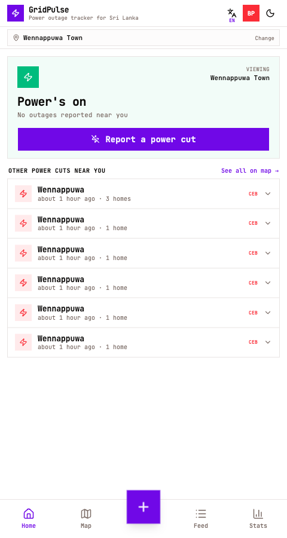
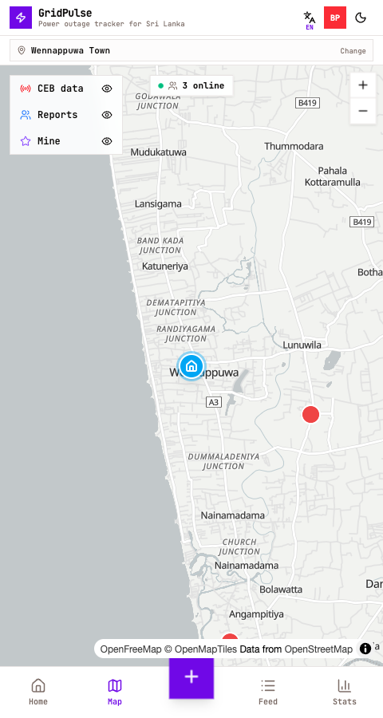
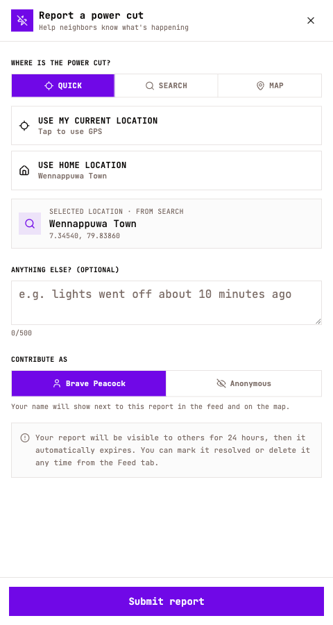
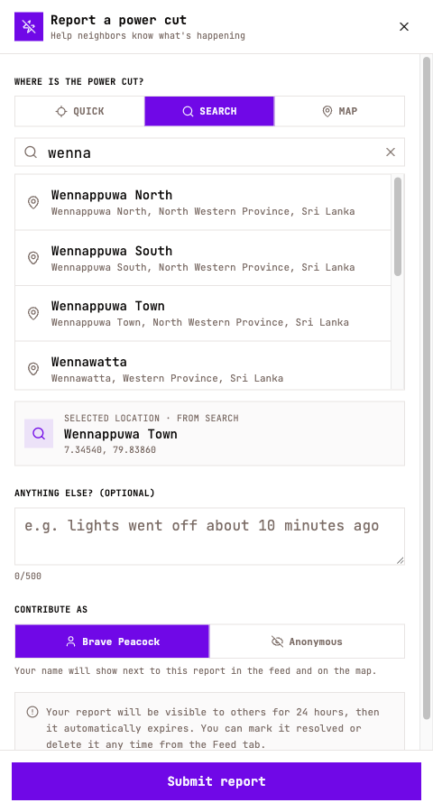
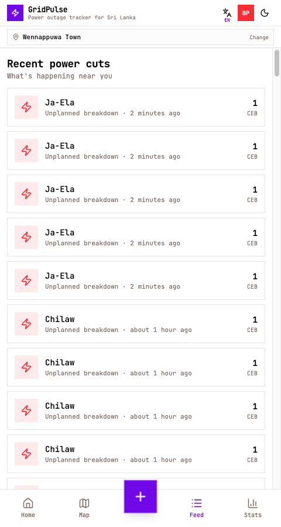
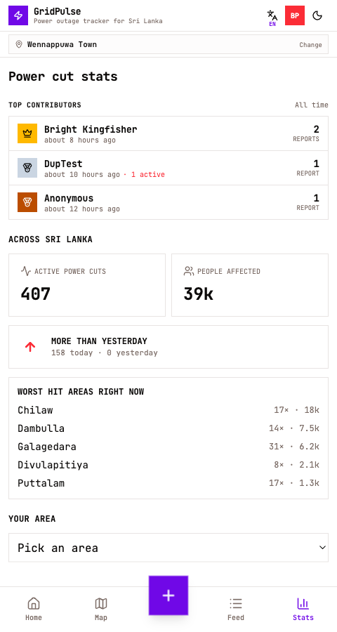
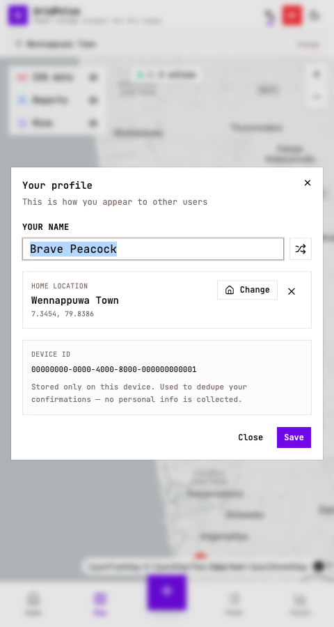

# GridPulse ⚡

> **"Is there power at my place right now — and if not, when will it come back?"**
> A live, crowd-powered power outage tracker for Sri Lanka. No signup. Works on any phone.

GridPulse (**කරන්ට් කට්** / **கரன்ட் கட்**) brings every power-cut in Sri Lanka onto one map — official CEB outages and reports from neighbours, side by side — so you can stop guessing when the lights will come back.

🌐 **Try it now:** [gridpulse-cyr.pages.dev](https://gridpulse-cyr.pages.dev)

---

## The problem

When the power goes out in Sri Lanka, most people end up doing the same frustrating loop:

- Refreshing the **CEB Care** site to see if their area is listed.
- Texting cousins and neighbours to ask "do you have power?"
- Wondering whether it's a planned cut, a breakdown, or just a tripped main.
- Having no idea when it will be restored.

There's no single place that combines official CEB information with what people on the street are actually seeing — and nothing that's friendly to use on a phone in the dark.

GridPulse is that one place.

---

## What it does

- 🔌 **Tells you instantly** whether the power is out at your location, and how many neighbours are affected.
- 🗺️ **Shows every active outage on a live map** — official CEB breakdowns and crowd reports together.
- 📣 **Lets you report a power-cut in two taps**, anonymously, so your neighbours benefit too.
- 📊 **Surfaces useful patterns** — which areas are worst hit right now, how often your area loses power, when peak outage hours are.
- 📍 **Works for anywhere in Sri Lanka** — pick any city, even if your phone's GPS is off.
- 🌐 **Speaks your language** — English, සිංහල, தமிழ்.
- 📴 **Works during the outage itself** — installs as a PWA, caches the map, and queues your report until the connection comes back.

---

## Features at a glance

### 🏠 Home — "Is the power on?"

The first thing you see. A big, plain-language answer for your exact location, plus a list of nearby power-cuts you can tap into for details.

---

### 🗺️ Live map — every outage in one view

CEB official outages, your neighbours' reports, and your own pins — all on one mobile-friendly map. Toggle the layers on and off, tap any marker for details, or pan around to see other areas.

---

### 📣 Report a power-cut

Tap the **+** button. Pick where the cut is (current location, your saved home, or any city in Sri Lanka). Add an optional note. Submit. That's it — no signup, no email, no ads. Your report helps everyone nearby get a clearer picture.

---

### 🔍 Pick any city in Sri Lanka

If your GPS is off or you're checking on family in another town, search for the place by name. Type-ahead suggestions cover every populated area in the country.

---

### 📰 Recent power-cuts feed

A scrollable timeline of every recent outage near you — sorted newest first, with the area name, type (planned vs unplanned), and how long ago it started.

---

### 📊 Stats — see the patterns

Island-wide totals (active outages, people affected, today vs yesterday), the worst-hit areas right now, top community contributors, and a per-area drilldown with peak-hour history.

---

### 👤 Anonymous-by-default profile

You get a friendly random name like "Brave Peacock" the first time you open the app — that's all anyone else sees next to your reports. No email, no phone number, no tracking. You can save a home location to skip GPS prompts in the future.

---

## How to use it

1. **Open the app** at [gridpulse-cyr.pages.dev](https://gridpulse-cyr.pages.dev) on your phone.
2. **Allow location** (or pick your city manually if you'd rather not share GPS).
3. **Check the home screen** to see whether there's a known cut near you.
4. **Tap the + button** to report a cut yourself if you're sitting in the dark — your report shows up to neighbours within seconds.
5. **Install it** when your browser offers the "Add to Home Screen" prompt — it then works just like a native app, including offline.

That's the whole flow. There's nothing else to learn.

---

## A few things that make it nice to use

- **Mobile-first.** Designed for one-handed use during a real power-cut. Big buttons, no tiny tap targets, readable in dark mode.
- **Works offline.** Once you've opened it once, the app, the map tiles for your area, and your last set of outages are cached. Reports you submit during the cut sync automatically when the connection comes back.
- **No accounts, no emails, no ads.** A random pseudonym is all the identity you need.
- **Auto-merging.** If you report a cut that the CEB has already announced, the two get linked into one story so the map doesn't show duplicates.
- **Trilingual.** Switch languages from the header — every label, button, and message is fully translated.

---

## Languages

| Language | App name |
|---|---|
| English | GridPulse |
| සිංහල | කරන්ට් කට් *(literally "current cut", the everyday phrase)* |
| தமிழ் | கரன்ட் கட் |

---

## Credits

GridPulse builds on a few generous public projects:

- **CEB Care** — official Ceylon Electricity Board outage portal ([cebcare.ceb.lk](https://cebcare.ceb.lk))
- **OpenFreeMap** + **OpenStreetMap** — free, open vector basemaps
- **GeoPop** — self-hosted Sri Lanka geocoding & population data

This project is not affiliated with or endorsed by the Ceylon Electricity Board. Outage information is fetched from publicly available CEB Care endpoints.

---

## License

[MIT](LICENSE) — free to use, copy, fork, and adapt.
